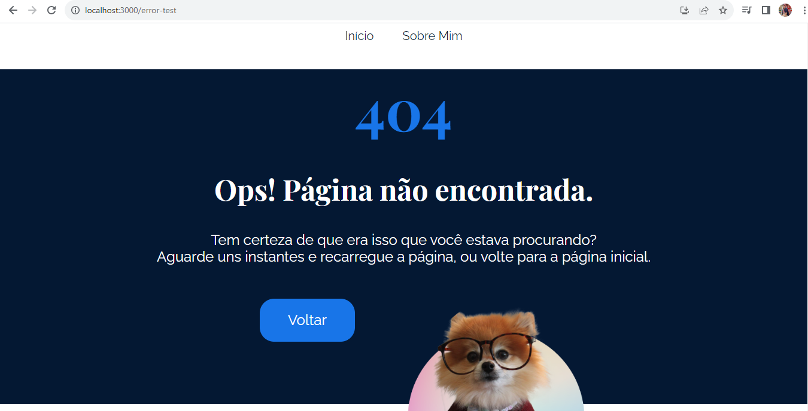

## Welcome again to another React project! 👋

# Opa, Eaí?!

New React Project!

### Standard View
- This structure appears in both pages.


### About Me page

- Here you can read a little about me. I didn't write it in English yet =X .


### Posts

- Chose a post to click and see:


### Post 1

- Post 1 for example


### 404 Page

- If you type an incorret address.



## Some code that I'm proud of
```js
return (
    <Routes>
        <Route path="*" element={<PaginaPadrao />}>
            <Route index element={<PostModelo
                fotoCapa={`/assets/posts/${post.id}/capa.png`}
                titulo={post.titulo}
            >
                <div className="post-markdown-container">
                    <ReactMarkdown>
                        {post.texto}
                    </ReactMarkdown>
                </div>
                <h2 
                    className={styles.tituloOutrosPosts}
                >
                    Outros posts que você pode gostar
                </h2>
                <ul className={styles.postsRecomendados}>
                    {postsRecomendados.map((post) => (
                        <li key={post.id}>
                            <PostCard post={post}/>
                        </li>
                    ))}
                </ul>
        </PostModelo>}/>
        </Route>
    </Routes>
)
```

## Built with

- REACT;
- CSS custom properties;
- JavaScript;
- Sweat 😫.

## Test the project yourself: [Teste the project here!!!](#)

### You can:

- Choose between two diferent Routes;
- Click and see diferent posts;
- Receive four recomended posts;
- Read about me;
- Receive a 404 error message and come back to the previous page.

## Author

- Website - [My GitHub](https://github.com/lucasbailo)
- Frontend Mentor - [@lucasbailo](https://www.frontendmentor.io/profile/lucasbailo)
- Instagram - [@lucassbailo](https://www.instagram.com/lucassbailo/)
- LinkedIn - [Lucas Bailo](https://www.linkedin.com/in/lcsbailo)